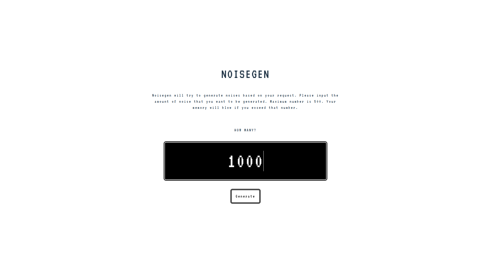
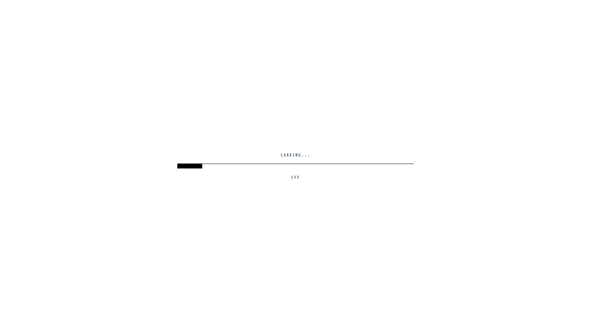
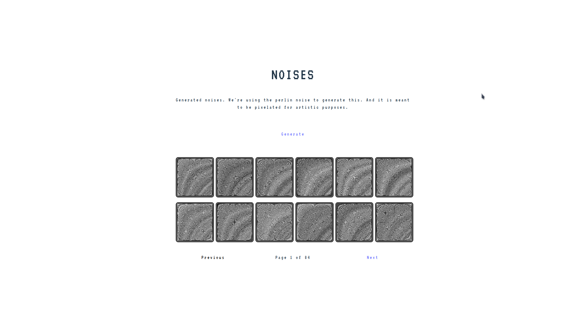
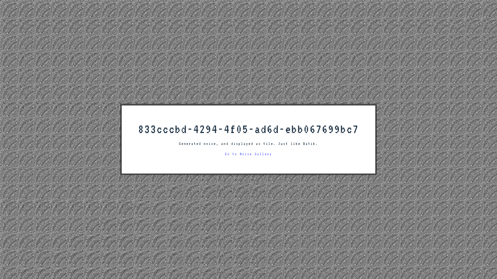

# Noisegen

Just a simple perlin noise visualier. This project is written using react and express.

## Getting Started

To get started, you just need to install lerna on project root directory by running:

```
yarn
```

## Development

To start developing this project, run:

```
lerna run dev
```

## Building

```
lerna run build
```

# Screenshots






# License

This project is under [MIT License](./LICENSE).
